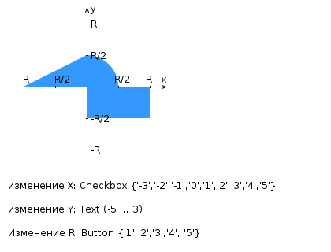

# Лабораторная работа №1

## Задание

Разработать HTML-страницу с JavaScript и CSS, определяющую попадание точки на координатной плоскости в заданную область. Область задаётся вариантом и приведена на рисунке. Её необходимо нарисовать средствами Canvas.

Кроме координатной плоскости, на странице должна быть HTML-форма с полями X, Y и R. Типы полей формы и допустимые значения определены вариантом:

- X — `checkbox`, допустимые значения: `{-3, -2, -1, 0, 1, 2, 3, 4, 5}`;
- Y — текстовое поле, допустимый диапазон: `[-5; 3]`;
- R — `button`, допустимые значения: `{1, 2, 3, 4, 5}`.

Страница должна содержать сценарий на JavaScript, осуществляющий валидацию введённых значений. Любые некорректные значения, например буквы в координатах точки или отрицательный радиус, должны блокироваться.

Точка задаётся данными формы. Факт её попадания в область должен вычисляться средствами JavaScript в момент отправки формы.

Результаты проверок необходимо:

- отображать в таблице на странице;
- сохранять между перезагрузками страницы с помощью `localStorage`;
- дополнять датой и временем выполнения проверки.

Дата и время должны отображаться строго в русской локализации с учётом текущего часового пояса клиентского устройства. При смене часового пояса должен отображаться тот же момент времени, пересчитанный для нового часового пояса.

Страница и все необходимые CSS- и JS-файлы должны быть развёрнуты на сервере Helios с использованием штатного веб-сервера и быть публично доступны. Самостоятельно поднимать веб-сервер на Helios не требуется; инструкция по публикации размещена в LMS.

## Требования к странице

- Для расположения текстовых и графических элементов использовать табличную вёрстку.
- Таблицу стилей разместить непосредственно в HTML-документе.
- Продемонстрировать использование:
  - селекторов элементов;
  - селекторов дочерних элементов;
  - селекторов идентификаторов;
  - селекторов псевдоклассов;
  - наследования и каскадирования CSS.
- Добавить шапку с ФИО студента, номером группы и номером варианта.
- Для шапки явно задать в CSS шрифт `monospace`, его цвет и размер.
- Отступы элементов ввода задавать в пикселях.

## Схема варианта

## Вопросы к защите

1. Протокол HTTP: структура запросов и ответов, методы запросов, коды ответов сервера, заголовки запросов и ответов.
2. Язык разметки HTML: особенности, основные теги и атрибуты тегов.
3. Структура HTML-страницы. Объектная модель документа (DOM).
4. HTML-формы: задание метода HTTP-запроса, правила размещения форм на страницах, виды полей ввода.
5. Каскадные таблицы стилей (CSS): правила и селекторы, виды селекторов, особенности их применения, приоритеты правил, преимущества CSS перед заданием стилей через атрибуты тегов.
6. LESS, Sass и SCSS: ключевые особенности, сравнительные характеристики, совместимость с браузерами, трансляция в обычный CSS.
7. Клиентские сценарии: особенности, сферы применения, язык JavaScript.
8. Версии ECMAScript, новые возможности ES6 и ES7.
