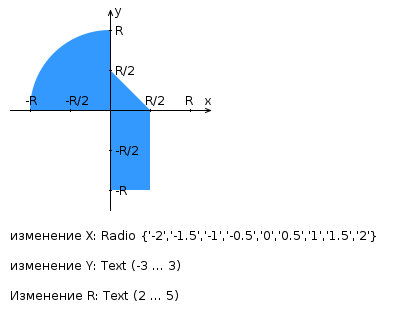

# Лабораторная работа №2

## Задание

Доработать лабораторную работу №1 и разработать FastCGI-сервер на языке Java, определяющий попадание точки на координатной плоскости в заданную область, а также создать HTML-страницу, формирующую данные для отправки на обработку этому серверу.

Параметр `R` и координаты точки должны передаваться серверу посредством HTTP-запроса. Сервер должен выполнять валидацию данных и возвращать HTML-страницу с таблицей, содержащей полученные параметры и результат вычислений — факт попадания или непопадания точки в область. Вместо HTML-страницы допускается возвращать JSON-строку.

Предыдущие результаты должны сохраняться между запросами и отображаться в таблице.

Ответ сервера также должен содержать:

- текущее время;
- время работы скрипта.

## Комментарии по выполнению

- Поднять Apache httpd от имени своего пользователя на сервере Helios. Шаблон конфигурационного файла доступен для скачивания на странице задания.
- Настроить веб-сервер для обслуживания статического контента (`HTML`, `CSS`, `JavaScript`) и перенаправления запросов за динамическим контентом к FastCGI-серверу.
- Реализовать FastCGI-сервер на языке Java и запустить его на Helios. Вспомогательная библиотека в виде JAR-архива доступна на странице задания.
- Продемонстрировать понимание принципов AJAX посредством обращений из JavaScript к FastCGI-серверу.
- Сохранить требования лабораторной работы №1, учитывая дополнительные параметры текущего варианта.

## Параметры варианта

- Данные формы передаются на обработку посредством `GET`-запроса.
- `X` — `radio`, допустимые значения: `{-2, -1.5, -1, -0.5, 0, 0.5, 1, 1.5, 2}`.
- `Y` — текстовое поле, допустимый диапазон: `(-3; 3)`.
- `R` — текстовое поле, допустимый диапазон: `(2; 5)`.

## Схема варианта

Область включает:

- четверть круга радиуса `R` во второй четверти;
- прямоугольный треугольник с катетами `R/2` в первой четверти;
- прямоугольник шириной `R/2` и высотой `R` в четвёртой четверти.

## Вопросы к защите

1. Синхронная и асинхронная обработка HTTP-запросов. AJAX.
2. Библиотека jQuery: назначение, основные API, использование для реализации AJAX и работы с DOM.
3. Реализация AJAX с помощью SuperAgent.
4. Серверные сценарии: CGI — определение, назначение и ключевые особенности.
5. FastCGI: особенности технологии, преимущества и недостатки относительно CGI.
6. FastCGI-сервер на языке Java.
